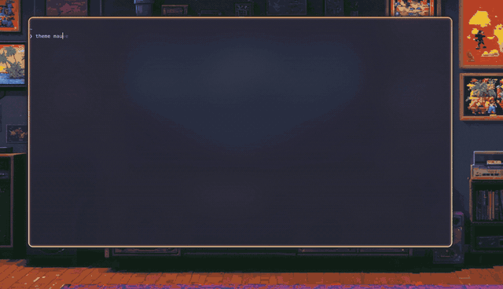

# hypr-themes

> One-command theme switcher for Hyprland. Define a theme once, apply it across
> border, glow, wofi, waybar, dunst, hyprlock and wallpaper.




## How it works (read before installing)

hypr-themes **never overwrites your configs.** Each theme switch regenerates a
small, tool-owned **color partial** per app; your own config files pull those in
through each app's native include mechanism and are left untouched:

| App       | Generated partial (tool-owned)        | Your config includes it via            |
|-----------|---------------------------------------|----------------------------------------|
| Hyprland  | `hypr/modules/theme.lua`              | `local theme = require("modules/theme")` |
| hyprlock  | `hypr/hyprlock-theme.conf`            | `source = ~/.config/hypr/hyprlock-theme.conf` |
| wofi      | `wofi/colors.css`                     | `@import url(".../colors.css")` (absolute) |
| waybar    | `waybar/colors.css`                   | `@import url(".../colors.css")` (absolute) |
| dunst     | `dunst/dunstrc.d/99-hypr-themes.conf` | drop-in — loaded automatically, no edit |
| hyprpaper | `hypr/hyprpaper.conf`                 | *(fully managed — wallpaper only)*     |

So your `kb_layout`, gaps, blur, fonts, geometry — anything that isn't a theme
color — stays exactly where you put it, switch after switch.

On install, if you don't already have one of these base configs, a ready-made
**skeleton** (with the include line wired up) is copied from `skeleton/`. If you
*do* have one, it's left alone and the installer prints the single line to add.
The only fully managed file is `hyprpaper.conf` (it holds nothing but the
wallpaper path); a pristine `.orig` backup of it is kept and restored by
`uninstall.sh`.

> **Wallpapers are not bundled.** The repo stays light; themes reference an image
> *by name*. Point `WALLPAPER_DIR` at your own folder, and the installer (or
> `theme wallpaper`) helps you associate one. A theme with no matching image
> keeps your current wallpaper — it never breaks.

To ship your own look, edit the `.theme` files (colors) — not your configs.

## Quick start

```bash
git clone https://github.com/thenullstackdeveloper/hypr-themes ~/Projects/hypr-themes
cd ~/Projects/hypr-themes
./install.sh        # guided: asks for your wallpaper folder + default theme
theme               # interactive picker (wofi)
theme peach         # apply directly
```

`install.sh` is a small wizard: it checks dependencies (via `scripts/check-deps.sh`,
which you can also run on its own), asks where your wallpapers live and which theme
to default to, symlinks `theme` into `~/.local/bin`, and applies your default
theme. Run it without a terminal (pipe/CI) and it falls back to copying
`config.example.sh` silently.

```bash
./scripts/check-deps.sh     # required vs recommended tools, with package hints
```

## Why

Changing the color palette of a Hyprland setup means editing half a dozen files by
hand (`config.lua` border + glow, `hyprlock.conf`, `hyprpaper.conf`, `wofi/style.css`,
`waybar/style.css`, `dunst/dunstrc`). Forget one and your visuals drift. hypr-themes keeps a single
source of truth per theme and regenerates one small color partial per app — never
your configs. One command. No drift, no clobbered settings.

## Commands

```
theme <name>          Apply the theme <name>
theme                 Looping picker (wofi): browse, then keep or revert
theme next            Apply the next theme (wraps) — bind it to a key
theme prev            Apply the previous theme (wraps)
theme list            List available themes
theme current         Show the active theme
theme wallpaper [n]   Pick/change the wallpaper for a theme (default: active)
theme --help          Help
```

## Wallpapers

Each theme names a wallpaper (e.g. `friki-salon.jpg`), resolved against your
`WALLPAPER_DIR`. When you apply a theme whose image isn't in that folder **and
you're in a terminal**, the script offers to associate one:

```
Theme 'peach' — Warm peach accent for retro/CRT/pixel-art wallpapers
No wallpaper found for this theme in /home/you/Pictures/Wallpapers.
Associate a wallpaper now? [Y/n] y
Images in /home/you/Pictures/Wallpapers:
   1) arbol.jpg
   2) cerezos.jpg
   ...
Choose a number, type a filename, or Enter to skip:
```

Your choice is saved per-user in `~/.config/hypr-themes/wallpapers.conf` (never in
the repo theme), so it sticks. Change it any time with `theme wallpaper <name>`.
Outside a terminal (keybind, pipe) nothing is asked — the current wallpaper is
kept and a warning is printed.

## Themes included

Ten themes, all sharing the Catppuccin Mocha base — they only differ in the accent
and the wallpaper, so they stay consistent across wofi, waybar, dunst and hyprlock.

| Theme | Accent | Pairs with |
|-------|--------|-----------|
| `peach` | warm orange | retro / CRT / pixel-art |
| `mauve` | purple | fantasy / dreamy |
| `pink` | bright pink | sakura / sunset / synthwave |
| `red` | red | sunset / autumn-maple / dramatic |
| `yellow` | gold | autumn / desert / sunny |
| `green` | green | forest / nature / foliage |
| `teal` | teal | turquoise / water / tropical / aurora |
| `sky` | cyan | clear-sky / glacier / snow |
| `blue` | azure | ocean / night-city / deep-space |
| `lavender` | periwinkle | dawn / soft-purple / misty |

Some themes ship without a default wallpaper; set one with `theme wallpaper <name>`.

## Creating your own theme

```bash
cp themes/peach.theme themes/teal.theme
$EDITOR themes/teal.theme   # change ACCENT_*, BORDER_*, GLOW_COLOR, WALLPAPER
theme teal
```

Backgrounds and text use the Catppuccin Mocha base shared across themes; most new
themes only change the accent block and the wallpaper. `_HEX` and `_RGB` variants
are duplicated because some targets need `#RRGGBB` and others need `R, G, B`.

## Reinstall / fresh machine

The installer is idempotent — re-run `./install.sh` any time (it won't clobber an
existing `config.sh` unless you choose to reconfigure). On a fresh machine:

```bash
git clone https://github.com/thenullstackdeveloper/hypr-themes ~/Projects/hypr-themes
cd ~/Projects/hypr-themes && ./install.sh
```

Then make sure your wallpapers are in `WALLPAPER_DIR` (or let the prompt associate
ones you have), and that `~/.local/bin` is on your `PATH` (the installer warns if
not). The `theme` symlink points at the repo, so if you move the repo, re-run the
installer to refresh it.

## Config

`install.sh` writes `~/.config/hypr-themes/config.sh`:

- `WALLPAPER_DIR` — folder holding your wallpapers.
- `DEFAULT_THEME` — applied on install / first run without arguments.
- `HYPR_CONFIG_DIR` / `WOFI_CONFIG_DIR` / `DUNST_CONFIG_DIR` — override only if your
  configs live outside `~/.config/<tool>`.

Per-theme wallpaper choices live in `~/.config/hypr-themes/wallpapers.conf`
(managed for you).

## Uninstall

```bash
./uninstall.sh   # restores the .orig backups, removes the symlink and user config
```

Daemons aren't restarted automatically — reload them or relaunch your Hyprland
session.

## Adding a Hyprland keybind

In your binds (not managed by this repo):

```lua
hl.bind(mod .. " + SHIFT + T", hl.dsp.exec_cmd("theme"))       -- looping picker
hl.bind(mod .. " + SHIFT + N", hl.dsp.exec_cmd("theme next"))  -- cycle forward
hl.bind(mod .. " + SHIFT + P", hl.dsp.exec_cmd("theme prev"))  -- cycle back
```

## How it works

A `.theme` file is a set of `KEY=VALUE` color variables. `theme` sources it and
renders each `templates/**/*.tmpl` with `envsubst` into a tool-owned **color
partial** (`theme.lua`, `colors.css`, `hyprlock-theme.conf`, the dunst drop-in),
then reloads the affected daemons. Your base configs include those partials and
are never written. Safety built in: an **envsubst allowlist** (only theme vars
expand, so tokens like hyprlock's `$FAIL` survive), **pristine `.orig` backups**
of any managed file, and **`luac -p` validation** of the generated `theme.lua`
before it replaces the live partial.

## Tests

Tests use [**bats**](https://github.com/bats-core/bats-core) (Bash Automated
Testing System) — a small test runner for shell scripts, like pytest for Bash.
Each test runs isolated; `run <cmd>` captures the exit code and output to assert
on. The suite also runs in CI on every push.

Install bats, then run the suite from the repo root:

```bash
# Arch/CachyOS: sudo pacman -S bats     Debian/Ubuntu: sudo apt install bats
# or, without root, into ~/.local:
#   git clone https://github.com/bats-core/bats-core && bats-core/install.sh ~/.local

bats tests/          # also needs envsubst; luac is optional (for the Lua check)
```

What each file covers:

- `paths.bats` — the `lib/paths.sh` path mapping and derivation.
- `render.bats` — every theme renders every template with no unsubstituted
  `${VAR}` (guards the `THEME_VARS` allowlist), and the Lua partial stays valid.
- `cli.bats` — `next`/`prev` cycle math and wallpaper-override resolution.
- `integration.bats` — apply and uninstall against a sandbox `$HOME` with stubbed
  daemons (partials written, `.orig` restore vs delete).

## License

MIT
